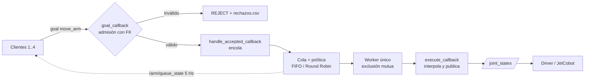

# Reto 2 — El Turno del Brazo (RB-2)

Cinemática directa y acceso concurrente al JetCobot  con **ROS 2 Humble**.

Cuatro clientes, un solo brazo. Ningún cliente publica en `/joint_states`: solo el worker del
nodo `arm_broker` (en el Jetson) habla con el driver. El broker recibe goals por una acción,
los admite o rechaza con la FK, los encola según una política y los ejecuta de a uno.



Flujo inicial en ASCII (equivalente):

```
 cliente 1 ─┐
 cliente 2 ─┤  goals (acción move_arm)      ┌────────────────────────────┐
 cliente 3 ─┼──────────────────────────────▶│ arm_broker (Jetson)        │──▶ /joint_states ──▶ JetCobot
 cliente 4 ─┘                               │ admisión FK → cola → worker│
        ▲                                   └─────────────┬──────────────┘
        └──────────────── /arm/queue_state (5 Hz) ◀───────┘
```

## Estado del proyecto

Actualizar esta tabla a medida que se avanza. Todo lo que no necesita el robot está hecho y probado
(19 pruebas automáticas, sin ROS 2); lo pendiente depende del Jetson y del brazo.

| Ítem | Contenido | Pts | Estado |
|---|---|:-:|---|
| 1 | Tabla DH + `fk(q)` + medición de 3 poses | 4 | `fk.py` con la tabla DH del manual oficial (la de `main`) y predicciones nuevas · **falta repetir la validación en el robot** con esa tabla (la anterior dio 5.8 / 5.9 / 5.9 mm) · evidencia en `evidencias/item1/` |
| 2 | Broker: cola, exclusión mutua, admisión con FK | 5 + 3 | `broker.py` y `politicas.py` implementados (admisión con rechazos con motivo, cupo atómico, worker único, cancelación, revalidación del paso) y probados con ROS simulado · **falta probarlo en el Jetson**, el diagrama de secuencia y el registro de rechazos real |
| 3 | Medición FIFO vs. Round Robin, bag + CSV + figura | 4 | Protocolo, predicción, script de corrida (`experimento_item3.sh`) y análisis (`metricas.py`) listos y probados con datos simulados · **faltan el ensayo con ROS 2 y las corridas oficiales** |
| 4 | Objetivo cartesiano (`send_coords`) auditado con la FK | 2 | `auditar_ik.py`, CSV de evidencia y documento listos y probados sin robot · **falta la sesión con el robot** |
| — | Diseño previo firmado y cierre reflexivo | 2 | Diseño previo (`docs/diseño_previo.*`) y cierre (`docs/cierre_reflexivo.*`) en borrador · **faltan firma, diagrama de secuencia y resultados** |

### Pendiente con el robot

- [ ] Repetir `verificar_fk.py` con la tabla DH del manual y completar la medición del ítem 1 (y, si el docente exige una medición independiente con regla, medirla; la validación es contra `get_coords()`).
- [ ] Ensayo con ROS 2 (`docs/ensayo_previo_ros2.md`): ~5 Hz en `/arm/queue_state`, un solo publicador de `/joint_states`, cola con varios goals, `ros2 bag`, exportación y análisis.
- [ ] Recalcular la predicción con la traza oficial, congelarla y firmar el diseño previo.
- [ ] Las dos corridas oficiales (`experimento_item3.sh fifo` y `round_robin`) y `resultados.md`.
- [ ] La sesión del ítem 4 (`auditar_ik.py`) con un objetivo seguro medido sobre el tablero; `evidencias/item_4/auditoria_ik.csv` solo tiene el encabezado hasta entonces (no se inventan filas). Guía: `docs/item4_auditoria_ik.md`.
- [ ] Video de 3 minutos y cierre reflexivo con resultados.

## Autoría

La estructura base (manifiestos, `CMakeLists.txt`, `setup.py`, interfaces, publicador de
`/arm/queue_state`, y los scripts originales de `analisis/` y `herramientas/`) la entrega el curso y
es idéntica para todos los equipos. El trabajo propio del equipo está en:

- `fk.py` (`DH`, `fk` y las validaciones), `broker.py` (`goal_callback`, `handle_accepted_callback`,
  `_worker`, `execute_callback` y lo que los rodea) y `politicas.py` (`FIFO`, `RoundRobin`);
- las ampliaciones de `cliente.py` (modo asíncrono, `inicio_unix`, validación de la traza) y de
  `analisis/metricas.py` (rechazos, violaciones de exclusión mutua, Jain a mitad de corrida, figura);
- las herramientas nuevas `auditar_ik.py`, `experimento_item3.sh` y `simular_politicas.py`, la traza
  provisional, las pruebas y los documentos de `docs/`.

## Estructura del repositorio

| Ruta | Contenido |
|---|---|
| `src/arm_broker_interfaces/` | Acción `MoveArm` y mensaje `QueueState` |
| `src/arm_broker/arm_broker/fk.py` | **Ítem 1**: tabla DH, `fk_matriz`, `fk`, límites, workspace, paso articular |
| `src/arm_broker/arm_broker/broker.py` | **Ítem 2**: nodo `arm_broker` (goal/accepted/execute callbacks, worker) |
| `src/arm_broker/arm_broker/politicas.py` | **Ítems 2–3**: políticas `FIFO` y `RoundRobin` |
| `src/arm_broker/arm_broker/cliente.py` | Cliente de carga (uno por integrante; modos secuencial y asíncrono) |
| `src/arm_broker/tests/` | `test_esenciales.py` (ítems 1 y 2), `test_analisis.py` (ítem 3), `test_auditar_ik.py` (ítem 4) y `simulacion_ros.py` (dobles de ROS, sin pruebas) |
| `herramientas/verificar_fk.py` | Compara `fk(q)` con el robot (corre en el Jetson) |
| `herramientas/auditar_ik.py` | **Ítem 4**: pide un objetivo con `send_coords()` y audita el `q` real con la FK propia |
| `herramientas/experimento_item3.sh` | **Ítem 3**: corre una política con el protocolo fijo y deja la evidencia en `evidencias/item_3/` |
| `herramientas/simular_politicas.py` | **Ítem 3**: modelo de cola para la predicción previa (usa las mismas clases de política) |
| `herramientas/generar_carga.py` | Genera trazas de poses reproducibles (misma semilla = mismo CSV) |
| `trazas/prueba.csv` | Traza **provisional** para desarrollo (no es la oficial del docente) |
| `analisis/exportar_csv.py` | Bag → `queue_state.csv` y `joint_states.csv` |
| `analisis/metricas.py` | Espera media/p95/máxima, inanición, Jain, rechazos con causas, violaciones de exclusión mutua y figura comparativa |
| `docs/tabla_dh.md` / `.pdf` | Tabla DH, convención y predicciones de las 3 poses |
| `docs/diseño_previo.md` / `.pdf` | Diseño previo: predicción, protocolo y comandos del ítem 3 |
| `docs/ensayo_previo_ros2.md` | Paso a paso del ensayo con ROS 2 antes de las corridas oficiales |
| `docs/item4_auditoria_ik.md` | Qué demuestra el ítem 4, tabla de evidencia y lista de verificación |
| `docs/cierre_reflexivo.md` / `.pdf` | Borrador del cierre reflexivo |
| `evidencias/` | `item1/` (predicción previa y validación de la FK), `medición_fk.csv` (encabezado), `item_3/` (una carpeta por política, la figura y los resultados) e `item_4/auditoria_ik.csv` |

## Reglas del reto y cómo las cubre el diseño

- **Publicador único:** solo el worker de `arm_broker` publica en `/joint_states`
  (`ArmBroker.mover`). `cliente.py` solo envía goals a `move_arm`.
- **Encolar ≠ ejecutar:** `handle_accepted_callback` solo encola; un único hilo worker
  desencola y ejecuta, y espera `pedido.fin` antes de sacar el siguiente.
- **Callback groups:** `ReentrantCallbackGroup` para aceptar goals mientras otro se ejecuta;
  `MutuallyExclusiveCallbackGroup` para el worker del brazo (un timer, no un hilo suelto); el
  timer de `/arm/queue_state` va en un grupo aparte.
- **La FK es el portero:** `goal_callback` rechaza con motivo legible si el objetivo está fuera
  de límites articulares, fuera del workspace o con paso articular excesivo.
- **Dominio DDS propio:** cada equipo usa su `ROS_DOMAIN_ID`.

## Requisitos

- ROS 2 Humble (Ubuntu 22.04) en el Jetson y en las máquinas cliente.
- `rmw_fastrtps_cpp`.
- `pymycobot` en el Jetson (`pip install pymycobot`) para `verificar_fk.py` y `auditar_ik.py` (Ítem 4).
- `matplotlib` para la figura de `metricas.py` (`pip install matplotlib`).
- `rosbag2` (`ros-humble-rosbag2` y `ros-humble-rosbag2-storage-default-plugins`) para grabar y exportar el bag del Ítem 3.
- Para las pruebas automáticas solo hace falta Python 3 (no ROS 2 ni el robot).

## Configuración de red

Cada integrante exporta estas variables en cada terminal (ver el laboratorio previo para el
archivo `super_client_configuration_file.xml`):

```bash
export ROS_DOMAIN_ID=<42 + n.º de equipo>        # asignado por el docente
export ROS_LOCALHOST_ONLY=0
export RMW_IMPLEMENTATION=rmw_fastrtps_cpp
export ROS_DISCOVERY_SERVER=<IP del Jetson del equipo>:11811
export FASTRTPS_DEFAULT_PROFILES_FILE=~/super_client_configuration_file.xml
ros2 daemon stop && ros2 daemon start
```

Si `ros2 node list` sale vacío, el problema es de descubrimiento, no del robot.

## Compilar

```bash
source /opt/ros/humble/setup.bash
colcon build --packages-select arm_broker_interfaces arm_broker
source install/setup.bash
```

## Ejecución

**En el Jetson**: lanzar el broker con la política a medir.

```bash
ros2 run arm_broker broker --ros-args -p politica:=fifo
# la segunda política:
ros2 run arm_broker broker --ros-args -p politica:=round_robin
```

El driver `sync_plan_nx` debe estar corriendo en el Jetson (una sola persona lo levanta).

Parámetros del broker: `politica` (`fifo` | `round_robin`), `cola_max` (20), `paso_max_rad`
(1.2), `duracion_movimiento_s` (3.0), `pasos_interpolacion` (10) y `archivo_rechazos`
(`rechazos.csv`; vacío para desactivar el registro).

**En cada máquina cliente** (uno por integrante, cada cual con su `client_id` y prioridad):

```bash
ros2 run arm_broker cliente --ros-args \
  -r __node:=cliente_1 \
  -p client_id:=ana -p priority:=3 -p traza:=/ruta/traza_oficial.csv -p repeticiones:=1
```

Para generar cola de verdad (varios pedidos pendientes a la vez) se usa el modo asíncrono, que
envía toda la traza sin esperar a que cada goal termine y recoge los resultados al final:

```bash
ros2 run arm_broker cliente --ros-args -r __node:=cliente_1 \
  -p client_id:=A -p priority:=1 -p traza:=/ruta/traza_oficial.csv \
  -p modo:=asincrono -p pausa_s:=0.0
```

`modo` es `secuencial` (por defecto: un goal a la vez, sirve para probar un movimiento) o
`asincrono`. Con `pausa_s` en 0 los goals de cada cliente llegan seguidos y compiten entre sí.
Con cuatro clientes asíncronos a la vez, FIFO y Round Robin atienden en órdenes distintos; en el
modo secuencial cada cliente tiene un solo pedido en cola y las dos políticas se parecen mucho.

`inicio_unix` (segundos Unix, por defecto 0 = enviar ya) hace que el cliente espere a un instante
común antes de enviar el primer goal; así varios clientes arrancan igual aunque cada `ros2 run`
tarde distinto en levantar.

La traza se valida al cargarla: cada fila no vacía (ni comentario `#`) debe tener exactamente
6 números finitos; si no, el cliente termina con un error que indica el archivo y la línea.

`-r __node:=cliente_N` le da a cada cliente un nombre de nodo distinto (`cliente_1`, `cliente_2`,
…); sin él todos se llaman `arm_client` y no se distinguen en `ros2 node list`. `client_id` es
el nombre que aparece en `/arm/queue_state`.

La traza es el CSV oficial del docente (mismo archivo para todos los equipos). Para ensayos
locales se puede generar una: `python3 herramientas/generar_carga.py --n 40 --semilla 7 --salida carga.csv`.

**Observar la cola** (visible para todos los clientes, a 5 Hz):

```bash
ros2 topic echo /arm/queue_state
```

## Ítem 1 — Cinemática directa

**Estado:** la tabla DH vigente es la del **manual oficial** (la de `main`). La validación en el robot
(5.8, 5.9 y 5.9 mm, todas ≤ 10 mm) se hizo con la **tabla anterior** y queda como histórica: con la tabla
nueva hay que **repetir la medición** (predicciones en `evidencias/item1/predicciones_dh_manual.txt`).

### Tabla DH

Parámetros del **manual oficial** del myCobot 280 / JetCobot (Elephant Robotics, Yahboom), los mismos
de `main`. DH estándar, `A_i = Rot_z(θ_i)·Trans_z(d_i)·Trans_x(a_i)·Rot_x(α_i)`, `θ_i = q_i + offset_i`,
`T_0_6 = A1·…·A6`. Implementada en `fk.py`; marcos y justificación en
[`docs/tabla_dh.md`](docs/tabla_dh.md) y [`docs/diseño_previo.md`](docs/diseño_previo.md).

| i | θ_i | d_i [mm] | a_i [mm] | α_i |
|:-:|:---|---:|---:|---:|
| 1 | q1 | 131.22 | 0 | +90° |
| 2 | q2 − 90° | 0 | −110.4 | 0° |
| 3 | q3 | 0 | −96 | 0° |
| 4 | q4 − 90° | 63.4 | 0 | +90° |
| 5 | q5 + 90° | 75.05 | 0 | −90° |
| 6 | q6 | 45.6 | 0 | 0° |

Quedan descartados los valores de la deducción previa en pizarra (d1 = 134.75, a2 = −110, d5 = 75.55,
d6 = 50). Límites articulares: J1–J5 ±165° (±2.87979 rad), J6 ±175° (±3.05433 rad).

### Poses, predicción previa, medición real y error

Poses del ítem 1: `cero`, `ready` y `girada` (`baja` queda como pose adicional).

**Predicción con la tabla vigente** (declarada antes de volver a medir, `evidencias/item1/predicciones_dh_manual.txt`):

| Pose | q comandado [rad] | Predicción [mm] | Medición con esta tabla |
|---|---|---|---|
| `cero` | [0, 0, 0, 0, 0, 0] | (45.60, −63.40, 412.67) | pendiente |
| `ready` | [0, −0.5, 0.5, 0, 0.5, 0] | (92.95, −41.54, 399.16) | pendiente |
| `girada` | [0.6, −0.4, 0.4, 0, 0.3, 0] | (99.63, 7.67, 403.96) | pendiente |

**Histórico, con la tabla anterior** (pizarra: d1 = 134.75, a2 = −110, d5 = 75.55, d6 = 50). La predicción se
declaró antes de medir (`evidencias/item1/predicciones_antes_de_medir.txt`, commit `a0cbc35`, anterior a la
validación `84e9f1a`); la validación (`evidencias/item1/validacion_fk.txt`) lee el `q` realmente adoptado
(`get_angles()`), calcula `FK(q_real)` y lo compara con `get_coords()`.

| Pose | Predicción previa [mm] | FK(q_real) [mm] | Robot, `get_coords()` [mm] | Error [mm] |
|---|---|---|---|---:|
| `cero` | (50.00, −63.40, 416.30) | (55.9, −62.6, 414.6) | (54.4, −63.2, 409.1) | 5.8 |
| `ready` | (96.62, −39.43, 402.83) | (102.1, −38.6, 400.9) | (100.9, −40.5, 395.4) | 5.9 |
| `girada` | (102.23, 11.03, 407.62) | (108.4, 14.6, 404.4) | (108.2, 11.9, 399.0) | 5.9 |

Esos 5.8–5.9 mm **no valen para la tabla nueva**: la FK cambia unos 4–5 mm (por ejemplo en `cero`,
(50.0, −63.4, 416.3) → (45.6, −63.4, 412.7)). Con la tabla nueva se repite `verificar_fk.py` y se
completa la columna «Medición». La conclusión de ≤ 10 mm se reescribe con esos datos.

- Sobre el histórico (tabla anterior): el error es casi constante entre poses, sobre todo en z (`FK(q_real) − Robot` ≈ +5.5 mm), lo que es
  compatible con un desfase de marco o de herramienta más que con un error en los `a_i`.
- El brazo no llega exactamente al `q` comandado, por eso el error se mide con `q_real`. Si se
  comparara la predicción declarada contra el robot saldría 8.4, 8.6 y 10.5 mm (`girada` pasaría de
  10 mm); tenerlo presente en la sustentación.
- «Robot» es lo que reporta el firmware con `get_coords()`, no una medición independiente con regla.

### Cómo repetirlo

```bash
python3 herramientas/verificar_fk.py              # mueve el brazo por las poses de prueba (Jetson, puerto libre)
python3 herramientas/verificar_fk.py --solo-leer  # solo compara donde está el brazo
```

## Ítem 2 — Broker

Flujo de un goal: **admisión** (`goal_callback`, barata e inmediata) → **encolado**
(`handle_accepted_callback`) → **ejecución exclusiva** (worker único → `execute_callback`).

Rechazos con motivo, todos calculados con `fk.py`:

| Causa | Función | Ejemplo de motivo |
|---|---|---|
| Límite articular | `fk.dentro_de_limites` | `2_Joint fuera de rango: 3.000 rad, límite [-2.87979, 2.87979]` |
| Workspace | `fk.dentro_del_workspace` | `efector a 512 mm de la base, máximo 480` |
| Paso excesivo | `fk.paso_articular` | paso mayor que `paso_max_rad` |

Además se rechaza con causa `cola_llena` si hay `cola_max` pedidos pendientes. Cada rechazo de
`goal_callback` se muestra en el log del broker y se agrega a `rechazos.csv` (`t_unix, client_id,
priority, causa, motivo, joint_positions`), que es la evidencia del registro de rechazos. La causa
es una de `limite`, `workspace`, `paso` o `cola_llena`.

Contadores de `/arm/queue_state`: `total_accepted` es el acumulado de goals que pasaron la
admisión, `total_rejected` cuenta solo los rechazados por `goal_callback` (los mismos que están
en `rechazos.csv`) y `total_completed` los que terminaron con éxito.

Cómo está armado el broker (`broker.py`):

- `goal_callback`: solo calcula con `fk.py` y devuelve ACCEPT/REJECT; nunca espera al brazo.
  El paso articular se mide contra `q_actual` en el momento de la admisión. El cupo de la cola
  se comprueba y se **reserva en una sola operación bajo el lock** (`self.reservados`), para que
  goals simultáneos no superen `cola_max`; la reserva se convierte en pedido real en
  `handle_accepted_callback`.
- `handle_accepted_callback`: crea el `Pedido` y lo añade a `pendientes`. No ejecuta ni publica.
- `_worker`: es un callback periódico (timer de 20 ms) del `MutuallyExclusiveCallbackGroup`, por
  lo que dos vueltas nunca se solapan. Cada vuelta elige **un** pedido con `politica.siguiente()`,
  llama a `goal_handle.execute()` y espera `pedido.fin` antes de volver; esa espera es la
  exclusión mutua. Los pedidos cancelados mientras esperaban se descartan sin mover el brazo.
  El timer de `/arm/queue_state` tiene su propio grupo, para seguir publicando mientras el worker
  espera, y el executor usa 4 hilos porque el worker ocupa uno mientras `execute_callback` usa otro.
- `execute_callback`: **vuelve a validar el paso articular** contra `q_actual` justo antes de
  mover, porque los pedidos de delante pudieron cambiar la pose desde la admisión. Si ya no es
  seguro, el goal termina `aborted` con `success=False` y el motivo en `message`, no mueve el
  brazo y queda en el log como `ABORTADO: paso_al_ejecutar`. No cambia `total_accepted` ni
  `total_rejected` ni entra en `rechazos.csv`, que son solo de `goal_callback`.
  Si es seguro, interpola desde `q_actual` hasta el destino en `pasos_interpolacion`
  pasos, publica feedback `EXECUTING` en cada uno, revisa la cancelación entre pasos y devuelve
  `wait_time_s` y `exec_time_s`. Al final siempre libera `pedido.fin`.
- Cancelación: `rclpy` solo envía el `Result` al cliente desde `execute_callback`, así que un
  pedido cancelado en la cola también pasa por `goal_handle.execute()` (que en ese caso no lo
  pasa a EXECUTING) y `execute_callback` lo cierra como `canceled` sin mover el brazo, con
  `success=False`, `message='cancelado mientras esperaba en cola'`, `wait_time_s` = lo que
  esperó y `exec_time_s=0.0`. Si se cancela durante la ejecución, el brazo se queda en la
  última pose publicada (no vuelve) y el mensaje es `cancelado durante la ejecución…`.
- Errores internos: si `_atender` falla, se registra el error y el pedido se da por fallido
  (`aborted`, `success=False`, `pedido.resultado` asignado y `pedido.fin` liberado), de modo que
  ni el worker ni el cliente quedan bloqueados.
- Los `goal_id` son la UUID completa (32 caracteres hexadecimales), sin recortar.

`/arm/queue_state` (`arm_broker_interfaces/msg/QueueState`) se publica a 5 Hz con el cliente en
ejecución, la longitud de la cola, las esperas y los totales aceptados/rechazados/completados.

- [ ] Diagrama de secuencia (`docs/`).
- [ ] Registro de rechazos con motivo (evidencia).

### Pruebas

**Pruebas esenciales** (una por fila de la tabla de pruebas esenciales), en `test_esenciales.py`:

```bash
cd src/arm_broker && python3 -m unittest discover -s tests -p "test_esenciales.py" -v
```

| Ítem | Prueba esencial | Qué demuestra |
|---|---|---|
| 1 FK | pose cero, predicciones de las 3 poses del diseño previo, cálculo del error | La FK y el criterio de error ≤ 10 mm (las 3 poses físicas necesitan el robot) |
| 2 | Goal válido → `ACCEPT` | El broker acepta una solicitud correcta |
| 2 | Límite articular → `REJECT` | Rechazo con motivo |
| 2 | Workspace → `REJECT` | Rechazo con motivo |
| 2 | Paso excesivo → `REJECT` | Rechazo con motivo |
| 2 | `handle_accepted` solo encola | Encolar ≠ ejecutar |
| 2 | Máximo 1 goal ejecutándose | Exclusión mutua |
| 2 | Solo el broker publica `/joint_states` | Regla de oro |
| 2 | FIFO y Round Robin generan el orden esperado | Las políticas funcionan |

Para los ítems 3 y 4 solo se conserva lo que se puede probar sin robot (sus corridas y la prueba
física necesitan el robot):

| Ítem | Archivo | Prueba | Qué demuestra |
|---|---|---|---|
| 3 | `test_analisis.py` | métricas completas sobre CSV sintéticos (y la figura, si hay matplotlib) | `metricas.py` reporta todo lo pedido |
| 3 | `test_analisis.py` | corrida limpia: 0 violaciones; goals intercalados: se detectan | Exclusión mutua = 0 |
| 3 | `test_analisis.py` | órdenes de FIFO y Round Robin con la misma carga | Las dos políticas con las mismas condiciones |
| 4 | `test_auditar_ik.py` | `error_cartesiano((0,0,0),(3,4,0)) == 5.0` | La fórmula del error |
| 4 | `test_auditar_ik.py` | grados → radianes | La conversión antes de la FK |
| 4 | `test_auditar_ik.py` | flujo con un brazo simulado: `send_coords` y auditoría del `q` leído | El flujo del ítem 4 |
| 4 | `test_auditar_ik.py` | sin objetivo o sin confirmación, no se mueve el brazo | Seguridad |

Todas se corren con:

```bash
cd src/arm_broker && python3 -m unittest discover -s tests -v
```

No necesitan ROS 2 ni el robot. `simulacion_ros.py` (sin pruebas) sustituye `rclpy` por dobles,
incluida la máquina de estados de los goals. Las pruebas del broker se omiten si ROS 2 está
instalado y no sustituyen la prueba real: falta correr el broker y los clientes en el Jetson.

Se retiraron las pruebas ampliadas de los ítems 2, 3 y 4 (cancelación, excepciones, cupo
concurrente, UUID, validación del CSV y del modo asíncrono, revalidación del paso, métricas
auxiliares, registro CSV de la auditoría…); el comportamiento sigue en el código y las pruebas están
en el historial de git (por ejemplo `git show 012d0de:src/arm_broker/test/test_broker_simulado.py`).

## Ítem 3 — Medición bajo contención

Políticas comparadas:

- **FIFO** (obligatoria).
- **Round Robin entre clientes** (`round_robin`), la política elegida. Recorre los clientes en
  orden circular a partir del último atendido y toma el más antiguo del primero que tenga algo
  pendiente. **Ignora la prioridad numérica.**
  - *Por qué:* con clientes que mandan ráfagas, FIFO hace esperar mucho más al que llega después;
    Round Robin reparte el turno y iguala las esperas medias por cliente.
  - *Lo que no hace:* no cambia la espera media global ni acorta las esperas extremas (el último
    goal de cada cliente sigue esperando casi toda la corrida), y según el orden de llegada puede
    empeorar el índice de inanición. Está predicho en `docs/diseño_previo.md` y se discute en el
    cierre reflexivo.

Convención de prioridad: **mayor número = más urgente** (ver `MoveArm.action`).

### Experimento justo

Las dos corridas usan las mismas condiciones y cambia solo `politica:=`: misma traza oficial del
docente, cuatro clientes con las mismas prioridades (A=1, B=2, C=3, D=4), mismas repeticiones,
`modo:=asincrono`, misma `pausa_s`, misma duración e interpolación y el mismo procedimiento de
inicio (broker → `ros2 bag record` → clientes con un `inicio_unix` común y 0.5 s de escalón).
El protocolo completo, la predicción del p95 y la plantilla de resultados están en
[`docs/diseño_previo.md`](docs/diseño_previo.md).

```bash
# Una corrida por política; deja todo en evidencias/item_3/<política>/ (falla si ya hay resultados)
TRAZA=/ruta/traza_oficial.csv bash herramientas/experimento_item3.sh fifo
TRAZA=/ruta/traza_oficial.csv bash herramientas/experimento_item3.sh round_robin

# Métricas y figura comparativa
python3 analisis/metricas.py evidencias/item_3/fifo/queue_state.csv \
    evidencias/item_3/round_robin/queue_state.csv \
    --salida evidencias/item_3/comparacion_politicas.png
```

```
evidencias/item_3/
├── fifo/         bag/, queue_state.csv, joint_states.csv, rechazos.csv, protocolo.txt, logs
├── round_robin/  (igual)
├── comparacion_politicas.png
└── resultados.md (copia de resultados_plantilla.md, completada después de medir)
```

Antes de las corridas oficiales se hace el ensayo con la traza provisional
([`docs/ensayo_previo_ros2.md`](docs/ensayo_previo_ros2.md)): broker a ~5 Hz en
`/arm/queue_state`, un solo publicador en `/joint_states`, cola con varios goals, `ros2 bag`,
exportación y análisis.

| Métrica | Fuente | Criterio |
|---|---|---|
| Violaciones de exclusión mutua | `metricas.py`: goals intercalados y mensajes de `/joint_states` sin goal ejecutando; más `ros2 topic info /joint_states -v` | **Cero** (eliminatorio) |
| Espera media y p95 por prioridad | `/arm/queue_state` → CSV | Se compara entre políticas |
| Índice de inanición | Espera máxima de la prioridad más baja | Se discute en el cierre |
| Equidad de Jain | Goals atendidos por cliente (al final y a mitad de la corrida) | Se reporta el valor |
| Goals rechazados | `total_rejected` y `rechazos.csv` del broker | Cantidad y causas |
| Error de FK | Medición física (Ítem 1) y FK(q) (Ítem 4) | ≤ 10 mm |

Notas sobre la medición:

- Al final de una traza finita todos los clientes fueron atendidos por igual y Jain vale 1.000 en
  ambas políticas; por eso `metricas.py` también reporta Jain **a mitad de la corrida**.
- Las esperas tienen resolución de ~0.2 s (`/arm/queue_state` a 5 Hz) y no incluyen los goals que
  empiezan a ejecutarse antes de la siguiente publicación.
- La detección de violaciones desde los CSV es un indicio (un bag no dice quién publicó cada
  mensaje); la prueba de publicador único es `ros2 topic info /joint_states -v`, que el script
  guarda en `publicadores_joint_states.txt`.

## Ítem 4 — Puerta a la cinemática inversa

Un único objetivo cartesiano `(x, y, z)` sobre la mesa, resuelto por el **firmware** con
`send_coords()` (pymycobot): **el equipo no escribe un solver de IK**. Luego se lee el `q`
realmente ejecutado (`get_angles()`, en grados), se pasa a radianes, se calcula `FK(q_real)` con
`fk.py` y se mide el error contra lo solicitado (≤ 10 mm). `get_coords()` es dato de apoyo.

```
objetivo → send_coords() → el firmware resuelve la IK → el brazo adopta q
        → get_angles() [°] → q [rad] → FK(q_real) → e = |FK(q_real) − objetivo|
```

```bash
python3 herramientas/auditar_ik.py --plantilla          # tabla vacía, sin robot
python3 herramientas/auditar_ik.py --solo-leer          # no mueve; diagnóstico FK vs get_coords()
python3 herramientas/auditar_ik.py --x X --y Y --z Z --rx RX --ry RY --rz RZ \
    --confirmo-espacio-despejado --guardar              # la auditoría; agrega a evidencias/item_4/
```

No hay objetivo por defecto: el punto seguro sobre el tablero se mide y se define en la sesión. La
evidencia queda en `evidencias/item_4/auditoria_ik.csv`. Detalle, tabla de evidencia, cómo leer el
resultado y la pregunta de la semana 5 (¿por qué esa solución y no la del codo contrario?) en
[`docs/item4_auditoria_ik.md`](docs/item4_auditoria_ik.md).

- [ ] Objetivo pedido, `q` ejecutado, `FK(q)` y error: `[completar]`

## Lista de entregables

- [x] Paquetes `arm_broker` y `arm_broker_interfaces` en GitHub.
- [x] README con instrucciones de ejecución (este archivo; quedan los campos `[completar]` del equipo).
- [ ] Documento de diseño previo **firmado antes de medir**: tabla DH, diagrama de secuencia y
      predicción del p95 por política (`docs/`; borrador listo con diagrama de secuencia en Mermaid; falta la firma).
- [ ] Bag, CSV y figura comparativa de las políticas (`evidencias/item_3/`).
- [x] Validación de las 3 poses del ítem 1 (`evidencias/item1/`).
- [ ] Auditoría del ítem 4 (`evidencias/item_4/auditoria_ik.csv`).
- [ ] Video de 3 minutos con los cuatro clientes en disputa y `/arm/queue_state` en pantalla.
- [ ] Cierre reflexivo (máximo una página): ¿qué política llevarían a CapyTown y por qué? (`docs/cierre_reflexivo.*`; borrador listo).

## Rúbrica (20 pts)

| Criterio | Pts | Dónde se evidencia |
|---|:-:|---|
| FK correcta y verificada contra el robot real | 4 | `fk.py`, `docs/tabla_dh.*`, `evidencias/item1/` |
| Broker: exclusión mutua y encolado correcto | 5 | `broker.py`, `politicas.py`, bag de `/joint_states` |
| Admisión validada con FK y rechazos razonados | 3 | `goal_callback`, registro de rechazos |
| Medición y comparación de políticas | 4 | `evidencias/`, figura comparativa |
| Ítem 4: error cartesiano auditado con FK propia | 2 | `auditar_ik.py`, `evidencias/item_4/`, `docs/item4_auditoria_ik.md` |
| Diseño previo y cierre reflexivo | 2 | `docs/`, cierre reflexivo |

**Penalización:** cualquier cliente que publique directamente en `/joint_states` anula el
puntaje del criterio de exclusión mutua.

## Equipo

| Integrante | Rol / `client_id` | Prioridad |
|---|---|:-:|
| `[completar]` | | |
| `[completar]` | | |
| `[completar]` | | |
| `[completar]` | | |

Equipo n.º `[completar]` · `ROS_DOMAIN_ID` = `[completar]`
