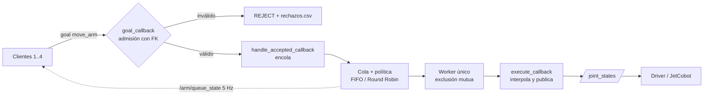

# Reto 2 — El Turno del Brazo (RB-2)

Cinemática directa y acceso concurrente al JetCobot con **ROS 2 Humble**.

Objetivo Original: Cuatro clientes, un solo brazo. Ningún cliente publica en `/joint_states`, pues solo el worker del
nodo `arm_broker` (en el Jetson) habla con el driver. El broker recibe goals por una acción,
los admite o rechaza con la FK, luego los encola según una política y finalmente los ejecuta en uno en uno.



Flujo inicial en ASCII (equivalente):

```
 cliente 1 ─┐
 cliente 2 ─┤  goals (acción move_arm)      ┌────────────────────────────┐
 cliente 3 ─┼──────────────────────────────▶│ arm_broker (Jetson)        │──▶ /joint_states ──▶ JetCobot
 cliente 4 ─┘                               │ admisión FK → cola → worker│
        ▲                                   └─────────────┬──────────────┘
        └──────────────── /arm/queue_state (5 Hz) ◀───────┘
```

## Estado del proyecto

Estado de entrega. Los ítems 2 y 4 habían quedado cerrados sin pruebas físicas por la fecha límite de entrega
(lunes 05 de octubre). El lunes 06 de octubre se aprovechó el espacio para probarlos con el robot y se
actualizaron el código, la evidencia y la documentación, de modo que **los ítems 1, 2 y 4 quedaron completados**. Pero, el
**ítem 3 se realizó a medias**, pues su código se creó para probarlo en el brazo, pero por falta de tiempo y de apoyo no se
pudo completar la medición.

| Ítem | Contenido | Pts | Estado |
|---|---|:-:|---|
| 1 | Tabla DH + `fk(q)` + medición de 3 poses | 4 | **Completado**: `fk.py`, tabla DH, predicción previa y validación en el robot; las 3 poses cumplen ≤ 10 mm (5.8, 5.9 y 5.9 mm) · evidencia en `evidencias/item1/` |
| 2 | Broker: cola, exclusión mutua, admisión con FK | 5 + 3 | **Completado y probado en el Jetson (06 de octubre)**: 3 rechazos físicos (límite, workspace, paso), un goal válido ejecutado (`SUCCEEDED`, ≈ 3.02 s) y exclusión mutua con dos goals (A2 ejecuta, B2 espera en cola 2.61 s) · evidencia en `evidencias/item_2/` |
| 3 | Medición FIFO vs. Round Robin, bag + CSV + figura | 4 | **A medias**: protocolo, predicción, `experimento_item3.sh` y `metricas.py` completados y probados con datos simulados · **faltaron las corridas oficiales con el brazo** (falta de tiempo y de apoyo) |
| 4 | Objetivo cartesiano (`send_coords`) auditado con la FK | 2 | **Completado con el brazo (06 de octubre)**: objetivo (129.3, 11.4, 398.8) mm, error cartesiano **3.62 mm ≤ 10 mm** · `evidencias/item_4/auditoria_ik.csv` y `docs/item4_auditoria_ik.md` |
| — | Diseño previo y cierre reflexivo | 2 | **Completado**: `docs/diseño_previo.md` y `docs/cierre_reflexivo.md` |

### Lo que nos faltó por desarrollar

- Las corridas oficiales del ítem 3 (`experimento_item3.sh fifo` y `round_robin`) con el brazo, su bag, el CSV y la figura comparativa.
- El ensayo con ROS 2 con la traza provisional (`docs/ensayo_previo_ros2.md`).
- La medición independiente con regla de las 3 poses del ítem 1.
- El video de 3 minutos.

## Autoría

La estructura base (manifiestos, `CMakeLists.txt`, `setup.py`, interfaces, publicador de
`/arm/queue_state`, y los scripts originales de `analisis/` y `herramientas/`) la entrega el curso y
es idéntica para todos los equipos. El trabajo propio del equipo está en:

- `fk.py` (`DH`, `fk` y las validaciones), `broker.py` (`goal_callback`, `handle_accepted_callback`,
  `_worker`, `execute_callback` y lo que los rodea) y `politicas.py` (`FIFO`, `RoundRobin`);
- las ampliaciones de `cliente.py` (modo asíncrono, `inicio_unix`, validación de la traza) y de
  `analisis/metricas.py` (rechazos, violaciones de exclusión mutua, Jain a mitad de corrida, figura);
- las herramientas nuevas `auditar_ik.py`, `experimento_item3.sh` y `simular_politicas.py`, la traza
  provisional, las pruebas y los documentos de `docs/`.

## Estructura del repositorio

| Ruta | Contenido |
|---|---|
| `src/arm_broker_interfaces/` | Acción `MoveArm` y mensaje `QueueState` |
| `src/arm_broker/arm_broker/fk.py` | **Ítem 1**: tabla DH, `fk_matriz`, `fk`, límites, workspace, paso articular |
| `src/arm_broker/arm_broker/broker.py` | **Ítem 2**: nodo `arm_broker` (goal/accepted/execute callbacks, worker) |
| `src/arm_broker/arm_broker/politicas.py` | **Ítems 2–3**: políticas `FIFO` y `RoundRobin` |
| `src/arm_broker/arm_broker/cliente.py` | Cliente de carga (uno por integrante; modos secuencial y asíncrono) |
| `src/arm_broker/tests/` | `test_esenciales.py` (ítems 1 y 2), `test_analisis.py` (ítem 3), `test_auditar_ik.py` (ítem 4) y `simulacion_ros.py` (dobles de ROS, sin pruebas) |
| `herramientas/verificar_fk.py` | Compara `fk(q)` con el robot (corre en el Jetson) |
| `herramientas/auditar_ik.py` | **Ítem 4**: pide un objetivo con `send_coords()` y audita el `q` real con la FK propia |
| `herramientas/experimento_item3.sh` | **Ítem 3**: corre una política con el protocolo fijo y deja la evidencia en `evidencias/item_3/` |
| `herramientas/simular_politicas.py` | **Ítem 3**: modelo de cola para la predicción previa (usa las mismas clases de política) |
| `herramientas/generar_carga.py` | Genera trazas de poses reproducibles (misma semilla = mismo CSV) |
| `trazas/prueba.csv` | Traza **provisional** para desarrollo (no es la oficial del docente) |
| `analisis/exportar_csv.py` | Bag → `queue_state.csv` y `joint_states.csv` |
| `analisis/metricas.py` | Espera media/p95/máxima, inanición, Jain, rechazos con causas, violaciones de exclusión mutua y figura comparativa |
| `docs/tabla_dh.md` | Tabla DH, convención y predicciones de las 3 poses |
| `docs/diseño_previo.md` | Diseño previo: predicción, protocolo y comandos del ítem 3 |
| `docs/ensayo_previo_ros2.md` | Paso a paso del ensayo con ROS 2 antes de las corridas oficiales |
| `docs/item4_auditoria_ik.md` | Qué demuestra el ítem 4, tabla de evidencia y lista de verificación |
| `docs/cierre_reflexivo.md` | Cierre reflexivo: qué política llevar a CapyTown |
| `evidencias/` | `item1/` (predicción previa y validación de la FK), `item_2/` (capturas y logs de las pruebas en el Jetson, `rechazos_reconstruidos.csv`) e `item_4/auditoria_ik.csv` (auditoría con el brazo). El ítem 3 no tiene evidencia: `experimento_item3.sh` crearía `item_3/` con una carpeta por política |

## Reglas del reto y cómo las cubre el diseño

- **Publicador único:** solo el worker de `arm_broker` publica en `/joint_states`
  (`ArmBroker.mover`). `cliente.py` solo envía goals a `move_arm`.
- **Encolar ≠ ejecutar:** `handle_accepted_callback` solo encola; un único hilo worker
  desencola y ejecuta, y espera `pedido.fin` antes de sacar el siguiente.
- **Callback groups:** `ReentrantCallbackGroup` para aceptar goals mientras otro se ejecuta;
  `MutuallyExclusiveCallbackGroup` para el worker del brazo (un timer, no un hilo suelto); el
  timer de `/arm/queue_state` va en un grupo aparte.
- **La FK es el portero:** `goal_callback` rechaza con motivo legible si el objetivo está fuera
  de límites articulares, fuera del workspace o con paso articular excesivo.
- **Dominio DDS propio:** cada equipo usa su `ROS_DOMAIN_ID`.

## Requisitos

- ROS 2 Humble (Ubuntu 22.04) en el Jetson y en las máquinas cliente.
- `rmw_fastrtps_cpp`.
- `pymycobot` en el Jetson (`pip install pymycobot`) para `verificar_fk.py` y `auditar_ik.py` (Ítem 4).
- `matplotlib` para la figura de `metricas.py` (`pip install matplotlib`).
- `rosbag2` (`ros-humble-rosbag2` y `ros-humble-rosbag2-storage-default-plugins`) para grabar y exportar el bag del Ítem 3.
- Para las pruebas automáticas solo hace falta Python 3 (no ROS 2 ni el robot).

## Configuración de red

Cada integrante del grupo exporta estas variables en cada terminal (ver `super_client_configuration_file.xml`). Valores usados por el grupo 8: `ROS_DOMAIN_ID = 42 + 8 = 50`, Jetson/JetCobot `172.51.1.20`, Discovery Server en el puerto `11811`, ROS 2 Humble y `rmw_fastrtps_cpp`.

```bash
export ROS_DOMAIN_ID=<42 + n.º de equipo>       
export ROS_LOCALHOST_ONLY=0
export RMW_IMPLEMENTATION=rmw_fastrtps_cpp
export ROS_DISCOVERY_SERVER=<IP del Jetson del equipo>:11811
export FASTRTPS_DEFAULT_PROFILES_FILE=~/super_client_configuration_file.xml
ros2 daemon stop && ros2 daemon start
```

Si `ros2 node list` sale vacío, el problema es de descubrimiento, no del robot.

**Variables usadas por el grupo 8**

En el Jetson (`arm_broker` y Discovery Server):

```bash
export ROS_DOMAIN_ID=50
export ROS_LOCALHOST_ONLY=0
export RMW_IMPLEMENTATION=rmw_fastrtps_cpp
export ROS_DISCOVERY_SERVER=127.0.0.1:11811
export FASTRTPS_DEFAULT_PROFILES_FILE=/home/jetson/super_client_configuration_file.xml
```

En la Raspberry Pi 400 (clientes):

```bash
export ROS_DOMAIN_ID=50
export ROS_LOCALHOST_ONLY=0
export RMW_IMPLEMENTATION=rmw_fastrtps_cpp
export ROS_DISCOVERY_SERVER=172.51.1.20:11811
export FASTRTPS_DEFAULT_PROFILES_FILE=$HOME/super_client_g8.xml
```

## Compilar

```bash
source /opt/ros/humble/setup.bash
colcon build --packages-select arm_broker_interfaces arm_broker
source install/setup.bash
```

## Ejecución

**En el Jetson**: lanzar el broker con la política a medir.

```bash
ros2 run arm_broker broker --ros-args -p politica:=fifo
# la segunda política:
ros2 run arm_broker broker --ros-args -p politica:=round_robin
```

El driver `sync_plan_nx` debe estar corriendo en el Jetson (una sola persona lo levanta).

Parámetros del broker: `politica` (`fifo` | `round_robin`), `cola_max` (20), `paso_max_rad`
(1.2), `duracion_movimiento_s` (3.0), `pasos_interpolacion` (10) y `archivo_rechazos`
(`rechazos.csv`; vacío para desactivar el registro).

**En cada máquina cliente** (uno por integrante, cada cual con su `client_id` y prioridad):

```bash
ros2 run arm_broker cliente --ros-args \
  -r __node:=cliente_1 \
  -p client_id:=ana -p priority:=3 -p traza:=/ruta/traza_oficial.csv -p repeticiones:=1
```

Para generar cola de verdad (varios pedidos pendientes a la vez) se usa el modo asíncrono, que
envía toda la traza sin esperar a que cada goal termine y recoge los resultados al final:

```bash
ros2 run arm_broker cliente --ros-args -r __node:=cliente_1 \
  -p client_id:=A -p priority:=1 -p traza:=/ruta/traza_oficial.csv \
  -p modo:=asincrono -p pausa_s:=0.0
```

`modo` es `secuencial` (por defecto: un goal a la vez, sirve para probar un movimiento) o
`asincrono`. Con `pausa_s` en 0 los goals de cada cliente llegan seguidos y compiten entre sí.
Con cuatro clientes asíncronos a la vez, FIFO y Round Robin atienden en órdenes distintos; en el
modo secuencial cada cliente tiene un solo pedido en cola y las dos políticas se parecen mucho.

`inicio_unix` (segundos Unix, por defecto 0 = enviar ya) hace que el cliente espere a un instante
común antes de enviar el primer goal; así varios clientes arrancan igual aunque cada `ros2 run`
tarde distinto en levantar.

La traza se valida al cargarla: cada fila no vacía (ni comentario `#`) debe tener exactamente
6 números finitos; si no, el cliente termina con un error que indica el archivo y la línea.

`-r __node:=cliente_N` le da a cada cliente un nombre de nodo distinto (`cliente_1`, `cliente_2`,
…); sin él todos se llaman `arm_client` y no se distinguen en `ros2 node list`. `client_id` es
el nombre que aparece en `/arm/queue_state`.

La traza es el CSV oficial del docente (mismo archivo para todos los equipos). Para ensayos
locales se puede generar una: `python3 herramientas/generar_carga.py --n 40 --semilla 7 --salida carga.csv`.

**Observar la cola** (visible para todos los clientes, a 5 Hz):

```bash
ros2 topic echo /arm/queue_state
```

## Ítem 1 — Cinemática directa

**Resultado: las tres poses cumplen el criterio de error ≤ 10 mm (5.8, 5.9 y 5.9 mm).**

### Tabla DH

Las medidas del robot se tomaron del manual del JetCobot (Yahboom); luego, en pizarra, el equipo calculó los vectores x, y, z (rotación y traslación) de cada articulación y los llevó a la tabla DH. DH estándar, `A_i = Rot_z(θ_i)·Trans_z(d_i)·Trans_x(a_i)·Rot_x(α_i)`, `θ_i = q_i + offset_i`,
`T_0_6 = A1·…·A6`. Implementada en `fk.py`; justificación y marcos en
[`docs/tabla_dh.md`](docs/tabla_dh.md) y [`docs/diseño_previo.md`](docs/diseño_previo.md).

| i | θ_i | d_i [mm] | a_i [mm] | α_i |
|:-:|:---|---:|---:|---:|
| 1 | q1 | 134.75 | 0 | +90° |
| 2 | q2 − 90° | 0 | −110 | 0° |
| 3 | q3 | 0 | −96 | 0° |
| 4 | q4 − 90° | 63.4 | 0 | +90° |
| 5 | q5 + 90° | 75.55 | 0 | −90° |
| 6 | q6 | 50 | 0 | 0° |

### Poses, predicción previa, medición real y error

Se probaron 4 poses; se usan **las 3 primeras** (`cero`, `ready`, `girada`). La predicción se declaró
antes de medir (`evidencias/item1/predicciones_antes_de_medir.txt`, commit `a0cbc35`, anterior a la
validación `84e9f1a`). La validación (`evidencias/item1/validacion_fk.txt`) lee el `q` que el brazo
realmente adoptó (`get_angles()`), calcula `FK(q_real)` y lo compara con la posición que reporta el
robot (`get_coords()`).

| Pose | q comandado [rad] | Predicción previa [mm] | FK(q_real) [mm] | Robot, `get_coords()` [mm] | Error [mm] | ≤ 10 mm |
|---|---|---|---|---|---:|:-:|
| `cero` | [0, 0, 0, 0, 0, 0] | (50.00, −63.40, 416.30) | (55.9, −62.6, 414.6) | (54.4, −63.2, 409.1) | **5.8** | Sí |
| `ready` | [0, −0.5, 0.5, 0, 0.5, 0] | (96.62, −39.43, 402.83) | (102.1, −38.6, 400.9) | (100.9, −40.5, 395.4) | **5.9** | Sí |
| `girada` | [0.6, −0.4, 0.4, 0, 0.3, 0] | (102.23, 11.03, 407.62) | (108.4, 14.6, 404.4) | (108.2, 11.9, 399.0) | **5.9** | Sí |

Error medio 5.9 mm, máximo 5.9 mm. **Conclusión: la FK propia cumple el criterio de ≤ 10 mm en las tres
poses.** La cuarta pose probada (`baja`) dio 6.0 mm y no se cuenta.

- El error es casi constante entre poses, sobre todo en z (`FK(q_real) − Robot` ≈ +5.5 mm), lo que es
  compatible con un desfase de marco o de herramienta más que con un error en los `a_i`.
- El brazo no llega exactamente al `q` comandado, por eso el error se mide con `q_real`. Si se
  comparara la predicción declarada contra el robot saldría 8.4, 8.6 y 10.5 mm (`girada` pasaría de
  10 mm); tenerlo presente en la sustentación.
- «Robot» es lo que reporta el firmware con `get_coords()`, no una medición independiente con regla.

### Cómo repetirlo

```bash
python3 herramientas/verificar_fk.py              # mueve el brazo por las poses de prueba (Jetson, puerto libre)
python3 herramientas/verificar_fk.py --solo-leer  # solo compara donde está el brazo
```

## Ítem 2 — Broker

Flujo de un goal: **admisión** (`goal_callback`, barata e inmediata) → **encolado**
(`handle_accepted_callback`) → **ejecución exclusiva** (worker único → `execute_callback`).

Rechazos con motivo, todos calculados con `fk.py`:

| Causa | Función | Ejemplo de motivo |
|---|---|---|
| Límite articular | `fk.dentro_de_limites` | `2_Joint fuera de rango: 2.500 rad, límite [-2.36, 2.36]` |
| Workspace | `fk.dentro_del_workspace` | `efector a 512 mm de la base, máximo 480` |
| Paso excesivo | `fk.paso_articular` | paso mayor que `paso_max_rad` |

Además se rechaza con causa `cola_llena` si hay `cola_max` pedidos pendientes. Cada rechazo de
`goal_callback` se muestra en el log del broker y se agrega a `rechazos.csv` (`t_unix, client_id,
priority, causa, motivo, joint_positions`), que es la evidencia del registro de rechazos. La causa
es una de `limite`, `workspace`, `paso` o `cola_llena`.

Contadores de `/arm/queue_state`: `total_accepted` es el acumulado de goals que pasaron la
admisión, `total_rejected` cuenta solo los rechazados por `goal_callback` (los mismos que están
en `rechazos.csv`) y `total_completed` los que terminaron con éxito.

Cómo está armado el broker (`broker.py`):

- `goal_callback`: solo calcula con `fk.py` y devuelve ACCEPT/REJECT; nunca espera al brazo.
  El paso articular se mide contra `q_actual` en el momento de la admisión. El cupo de la cola
  se comprueba y se **reserva en una sola operación bajo el lock** (`self.reservados`), para que
  goals simultáneos no superen `cola_max`; la reserva se convierte en pedido real en
  `handle_accepted_callback`.
- `handle_accepted_callback`: crea el `Pedido` y lo añade a `pendientes`. No ejecuta ni publica.
- `_worker`: es un callback periódico (timer de 20 ms) del `MutuallyExclusiveCallbackGroup`, por
  lo que dos vueltas nunca se solapan. Cada vuelta elige **un** pedido con `politica.siguiente()`,
  llama a `goal_handle.execute()` y espera `pedido.fin` antes de volver; esa espera es la
  exclusión mutua. Los pedidos cancelados mientras esperaban se descartan sin mover el brazo.
  El timer de `/arm/queue_state` tiene su propio grupo, para seguir publicando mientras el worker
  espera, y el executor usa 4 hilos porque el worker ocupa uno mientras `execute_callback` usa otro.
- `execute_callback`: **vuelve a validar el paso articular** contra `q_actual` justo antes de
  mover, porque los pedidos de delante pudieron cambiar la pose desde la admisión. Si ya no es
  seguro, el goal termina `aborted` con `success=False` y el motivo en `message`, no mueve el
  brazo y queda en el log como `ABORTADO: paso_al_ejecutar`. No cambia `total_accepted` ni
  `total_rejected` ni entra en `rechazos.csv`, que son solo de `goal_callback`.
  Si es seguro, interpola desde `q_actual` hasta el destino en `pasos_interpolacion`
  pasos, publica feedback `EXECUTING` en cada uno, revisa la cancelación entre pasos y devuelve
  `wait_time_s` y `exec_time_s`. Al final siempre libera `pedido.fin`.
- Cancelación: `rclpy` solo envía el `Result` al cliente desde `execute_callback`, así que un
  pedido cancelado en la cola también pasa por `goal_handle.execute()` (que en ese caso no lo
  pasa a EXECUTING) y `execute_callback` lo cierra como `canceled` sin mover el brazo, con
  `success=False`, `message='cancelado mientras esperaba en cola'`, `wait_time_s` = lo que
  esperó y `exec_time_s=0.0`. Si se cancela durante la ejecución, el brazo se queda en la
  última pose publicada (no vuelve) y el mensaje es `cancelado durante la ejecución…`.
- Errores internos: si `_atender` falla, se registra el error y el pedido se da por fallido
  (`aborted`, `success=False`, `pedido.resultado` asignado y `pedido.fin` liberado), de modo que
  ni el worker ni el cliente quedan bloqueados.
- Los `goal_id` son la UUID completa (32 caracteres hexadecimales), sin recortar.

`/arm/queue_state` (`arm_broker_interfaces/msg/QueueState`) se publica a 5 Hz con el cliente en
ejecución, la longitud de la cola, las esperas y los totales aceptados/rechazados/completados.

- Diagrama de secuencia: `docs/diseño_previo.md`, sección 2 (Mermaid).
- Registro de rechazos con motivo: `rechazos.csv` lo genera el broker; en las pruebas con ROS simulado se
  comprueban todas las causas, y con el robot se probaron las tres (ver abajo).

### Pruebas en el Jetson (lunes 06 de octubre)

El ítem 2 se había cerrado sin esta prueba por la fecha límite (lunes 05 de octubre); el 06 se probó con el brazo.
Entorno: grupo 8, `ROS_DOMAIN_ID=50`, Jetson `172.51.1.20`, Discovery Server en el puerto 11811 (variables en
«Configuración de red»). Evidencia en `evidencias/item_2/`.

**Tres rechazos físicos** (todos `Goal was rejected`):

| Prueba | `client_id` | `q` [rad] | Motivo registrado |
|---|---|---|---|
| Límite articular | `g8_limite` (prioridad 1) | `[3.5, 0, 0, 0, 0, 0]` | `1_Joint fuera de rango: 3.500 rad, límite [-2.93, 2.93]` |
| Workspace | `g8_workspace` | `[0.0, 1.5, 2.4, 0, 0, 0]` | `efector a 71 mm de la base, demasiado cerca` |
| Paso excesivo | `g8_paso` | `[1.3, 0, 0, 0, 0, 0]` | `paso articular de 1.30 rad desde la pose actual, máximo 1.20` |

`evidencias/item_2/rechazos_reconstruidos.csv` reúne estas filas. Es una reconstrucción: el `rechazos.csv` original se
generó en el Jetson pero no se preservó, así que se rehízo desde las capturas, sin marcas de tiempo.

**Goal válido** (`g8_valido_3`, prioridad 1, `[0.3, 0, 0, 0, 0, 0]`): `Goal accepted` → `Feedback EXECUTING` → el brazo se
mueve → `Result success: true, message: ok` → `SUCCEEDED`, en ≈ 3.02 s. El broker no solo rechaza goals
incorrectos: también admite y ejecuta físicamente los válidos.

**Exclusión mutua** (dos goals, prueba automática):

| Cliente | Prioridad | `q` [rad] | Comportamiento | `wait_time_s` | `exec_time_s` |
|---|:-:|---|---|---:|---:|
| `g8_A2` | 1 | `[0, -0.5, 0.5, 0, 0.5, 0]` | ejecuta de inmediato; `SUCCEEDED` | 0.0109 | 3.0156 |
| `g8_B2` | 2 | `[0.6, -0.4, 0.4, 0, 0.3, 0]` | `QUEUED` (`queue_position: 1`) hasta `elapsed_s ≈ 2.49`, luego `EXECUTING`; `SUCCEEDED` | 2.6129 | 3.0147 |

B2 esperó en cola hasta que A2 terminó; nunca hubo dos goals ejecutándose a la vez. Hay además capturas de
`/arm/queue_state` a 5 Hz y de un único publicador de `/joint_states`.

### Pruebas

**Pruebas esenciales** (una por fila de la tabla de pruebas esenciales), en `test_esenciales.py`:

```bash
cd src/arm_broker && python3 -m unittest discover -s tests -p "test_esenciales.py" -v
```

| Ítem | Prueba esencial | Qué demuestra |
|---|---|---|
| 1 FK | pose cero, predicciones de las 3 poses del diseño previo, cálculo del error | La FK y el criterio de error ≤ 10 mm (las 3 poses físicas necesitan el robot) |
| 2 | Goal válido → `ACCEPT` | El broker acepta una solicitud correcta |
| 2 | Límite articular → `REJECT` | Rechazo con motivo |
| 2 | Workspace → `REJECT` | Rechazo con motivo |
| 2 | Paso excesivo → `REJECT` | Rechazo con motivo |
| 2 | `handle_accepted` solo encola | Encolar ≠ ejecutar |
| 2 | Máximo 1 goal ejecutándose | Exclusión mutua |
| 2 | Solo el broker publica `/joint_states` | Regla de oro |
| 2 | FIFO y Round Robin generan el orden esperado | Las políticas funcionan |

Para los ítems 3 y 4 solo se conserva lo que se puede probar sin robot (sus corridas y la prueba
física necesitan el robot):

| Ítem | Archivo | Prueba | Qué demuestra |
|---|---|---|---|
| 3 | `test_analisis.py` | métricas completas sobre CSV sintéticos (y la figura, si hay matplotlib) | `metricas.py` reporta todo lo pedido |
| 3 | `test_analisis.py` | corrida limpia: 0 violaciones; goals intercalados: se detectan | Exclusión mutua = 0 |
| 3 | `test_analisis.py` | órdenes de FIFO y Round Robin con la misma carga | Las dos políticas con las mismas condiciones |
| 4 | `test_auditar_ik.py` | `error_cartesiano((0,0,0),(3,4,0)) == 5.0` | La fórmula del error |
| 4 | `test_auditar_ik.py` | grados → radianes | La conversión antes de la FK |
| 4 | `test_auditar_ik.py` | flujo con un brazo simulado: `send_coords` y auditoría del `q` leído | El flujo del ítem 4 |
| 4 | `test_auditar_ik.py` | sin objetivo o sin confirmación, no se mueve el brazo | Seguridad |

Todas se corren con:

```bash
cd src/arm_broker && python3 -m unittest discover -s tests -v
```

No se necesito ROS 2 o el brazo. `simulacion_ros.py` sustituye `rclpy` por dobles,
incluida la máquina de estados de los goals. Las pruebas del broker se omiten si ROS 2 está
instalado y no sustituyen la prueba real, que se hizo en el Jetson el 06 de octubre (ver «Pruebas en el Jetson»).

## Ítem 3 — Medición bajo contención

> **Estado: a medias.** El código (`experimento_item3.sh`, `metricas.py`, `simular_politicas.py`), el protocolo y la predicción están hechos y probados con datos simulados. Las corridas oficiales con el brazo no se pudieron hacer por falta de tiempo y de apoyo, así que no hay bag, CSV ni figura reales.

Políticas comparadas:

- **FIFO** (obligatoria).
- **Round Robin entre clientes** (`round_robin`), la política elegida. Recorre los clientes en
  orden circular a partir del último atendido y toma el más antiguo del primero que tenga algo
  pendiente. **Ignora la prioridad numérica.**
  - *Por qué:* con clientes que mandan ráfagas, FIFO hace esperar mucho más al que llega después;
    Round Robin reparte el turno y iguala las esperas medias por cliente.
  - *Lo que no hace:* no cambia la espera media global ni acorta las esperas extremas (el último
    goal de cada cliente sigue esperando casi toda la corrida), y según el orden de llegada puede
    empeorar el índice de inanición. Está predicho en `docs/diseño_previo.md` y se discute en el
    cierre reflexivo.

Convención de prioridad: **mayor número = más urgente** (ver `MoveArm.action`).

### Experimento justo

Las dos corridas usan las mismas condiciones y cambia solo `politica:=`: misma traza oficial del
docente, cuatro clientes con las mismas prioridades (A=1, B=2, C=3, D=4), mismas repeticiones,
`modo:=asincrono`, misma `pausa_s`, misma duración e interpolación y el mismo procedimiento de
inicio (broker → `ros2 bag record` → clientes con un `inicio_unix` común y 0.5 s de escalón).
El protocolo completo, la predicción del p95 y la plantilla de resultados están en
[`docs/diseño_previo.md`](docs/diseño_previo.md).

Antes de las corridas oficiales se realiza el ensayo con la traza provisional
([`docs/ensayo_previo_ros2.md`](docs/ensayo_previo_ros2.md)): broker a ~5 Hz en
`/arm/queue_state`, un solo publicador en `/joint_states`, cola con varios goals, `ros2 bag`,
exportación y análisis.

| Métrica | Fuente | Criterio |
|---|---|---|
| Violaciones de exclusión mutua | `metricas.py`: goals intercalados y mensajes de `/joint_states` sin goal ejecutando; más `ros2 topic info /joint_states -v` | **Cero** (eliminatorio) |
| Espera media y p95 por prioridad | `/arm/queue_state` → CSV | Se compara entre políticas |
| Índice de inanición | Espera máxima de la prioridad más baja | Se discute en el cierre |
| Equidad de Jain | Goals atendidos por cliente (al final y a mitad de la corrida) | Se reporta el valor |
| Goals rechazados | `total_rejected` y `rechazos.csv` del broker | Cantidad y causas |
| Error de FK | Medición física (Ítem 1) y FK(q) (Ítem 4) | ≤ 10 mm |

Notas sobre la medición:

- Al final de una traza finita todos los clientes fueron atendidos por igual y Jain vale 1.000 en
  ambas políticas; por eso `metricas.py` también reporta Jain **a mitad de la corrida**.
- Las esperas tienen resolución de ~0.2 s (`/arm/queue_state` a 5 Hz) y no incluyen los goals que
  empiezan a ejecutarse antes de la siguiente publicación.
- La detección de violaciones desde los CSV es un indicio (un bag no dice quién publicó cada
  mensaje); la prueba de publicador único es `ros2 topic info /joint_states -v`, que el script
  guarda en `publicadores_joint_states.txt`.

## Ítem 4 — Puerta a la cinemática inversa

Un único objetivo cartesiano `(x, y, z)` sobre la mesa, resuelto por el **firmware** con
`send_coords()` (pymycobot): **el equipo no escribe un solver de IK**. Luego se lee el `q`
realmente ejecutado (`get_angles()`, en grados), se pasa a radianes, se calcula `FK(q_real)` con
`fk.py` y se mide el error contra lo solicitado (≤ 10 mm). `get_coords()` es dato de apoyo.

```
objetivo → send_coords() → el firmware resuelve la IK → el brazo adopta q
        → get_angles() [°] → q [rad] → FK(q_real) → e = |FK(q_real) − objetivo|
```

```bash
python3 herramientas/auditar_ik.py --plantilla          # tabla vacía, sin robot
python3 herramientas/auditar_ik.py --solo-leer          # no mueve; diagnóstico FK vs get_coords()
python3 herramientas/auditar_ik.py --x X --y Y --z Z --rx RX --ry RY --rz RZ \
    --confirmo-espacio-despejado --guardar              # la auditoría; agrega a evidencias/item_4/
```

**Sesión con el brazo (lunes 06 de octubre).** El ítem 4 también había quedado sin la sesión por la fecha límite del
05; se hizo el 06.

1. `--plantilla`: imprimió la tabla de evidencia vacía (la herramienta estaba lista).
2. `--solo-leer` (sin mover): `get_angles()` = (33.48, −24.43, 23.11, −1.05, 16.52, −23.11)°, `get_coords()` =
   (109.3, 11.4, 398.8), `FK(q_real)` = (109.5, 13.4, 404.4): error 5.94 mm (< 10 mm), diagnóstico previo.
3. Objetivo cartesiano: la pose leída desplazada +20 mm en X, `[129.3, 11.4, 398.8, −92.46, −22.42, −39.03]`, con
   `--velocidad 20 --modo 0 --espera 5 --confirmo-espacio-despejado --guardar`.

**Resultado oficial:** el firmware adoptó `q = (25.83, −19.42, 0.17, 13.79, 24.43, −23.29)°` (`q_real` = 0.4508,
−0.3389, 0.0030, 0.2407, 0.4264, −0.4065 rad), `get_coords()` = (126.8, 11.9, 394.6) y `FK(q_real)` = (127.3, 14.1,
400.0). Errores respecto al objetivo: X −2.02, Y +2.75, Z +1.20 mm; **error cartesiano 3.62 mm ≤ 10 mm**. La fila
está en `evidencias/item_4/auditoria_ik.csv` (reconstruida: el CSV original del laboratorio no se preservó; ver
`evidencias/item_4/README.md`).

**Codo contrario.** El firmware seleccionó una solución de IK cercana a la configuración articular inicial
(cambios de −7.65°, +5.01°, −22.94°, +14.84°, +7.91° y −0.18° en J1…J6), manteniendo continuidad de movimiento en
lugar de un cambio brusco hacia una solución alternativa de codo contrario. La API de `pymycobot` no expone el
criterio interno exacto con el que se elige la rama, por lo que la conclusión se basa en los ángulos iniciales y
finales observados y no en el algoritmo interno del firmware. Detalle en
[`docs/item4_auditoria_ik.md`](docs/item4_auditoria_ik.md).

## Lista de entregables

-  Paquetes `arm_broker` y `arm_broker_interfaces` en GitHub.
-  README con instrucciones de ejecución (este archivo).
-  Documento de diseño previo: tabla DH, diagrama de secuencia y predicción del p95 por política (`docs/diseño_previo.md`).
-  Validación de las 3 poses del ítem 1 (`evidencias/item1/`).
-  Pruebas del ítem 2 con el robot (06 de octubre): rechazos, goal válido y exclusión mutua (`evidencias/item_2/`).
-  Auditoría del ítem 4 con el brazo: `auditar_ik.py`, `evidencias/item_4/auditoria_ik.csv` y `docs/item4_auditoria_ik.md`.
-  Cierre reflexivo (`docs/cierre_reflexivo.md`), razonado con la predicción.
## Lo que esta a medias
-  Ítem 3 (código y predicción hechos): faltaron el bag, el CSV y la figura comparativa (`evidencias/item_3/`)
-  Video de 3 minutos.

## Rúbrica 

| Criterio | Pts | Dónde se evidencia |
|---|:-:|---|
| FK correcta y verificada contra el robot real | 4 | `fk.py`, `docs/tabla_dh.md`, `evidencias/item1/` |
| Broker: exclusión mutua y encolado correcto | 5 | `broker.py`, `politicas.py`, bag de `/joint_states` |
| Admisión validada con FK y rechazos razonados | 3 | `goal_callback`, registro de rechazos |
| Medición y comparación de políticas | 4 | `evidencias/`, figura comparativa |
| Ítem 4: error cartesiano auditado con FK propia | 2 | `auditar_ik.py`, `evidencias/item_4/`, `docs/item4_auditoria_ik.md` |
| Diseño previo y cierre reflexivo | 2 | `docs/`, cierre reflexivo |

**Penalización:** cualquier cliente que publique directamente en `/joint_states` anula el puntaje del criterio de exclusión mutua.

## Equipo

| Integrante | Equipo |
|---|---|
| Jorge Daniel Rivera Nagaro | Equipo 8 |
| Harold Lincoln Payco Espinoza | Equipo 8 |
| Rodrigo Sebastián Escobar Rosado | Equipo 8 |
