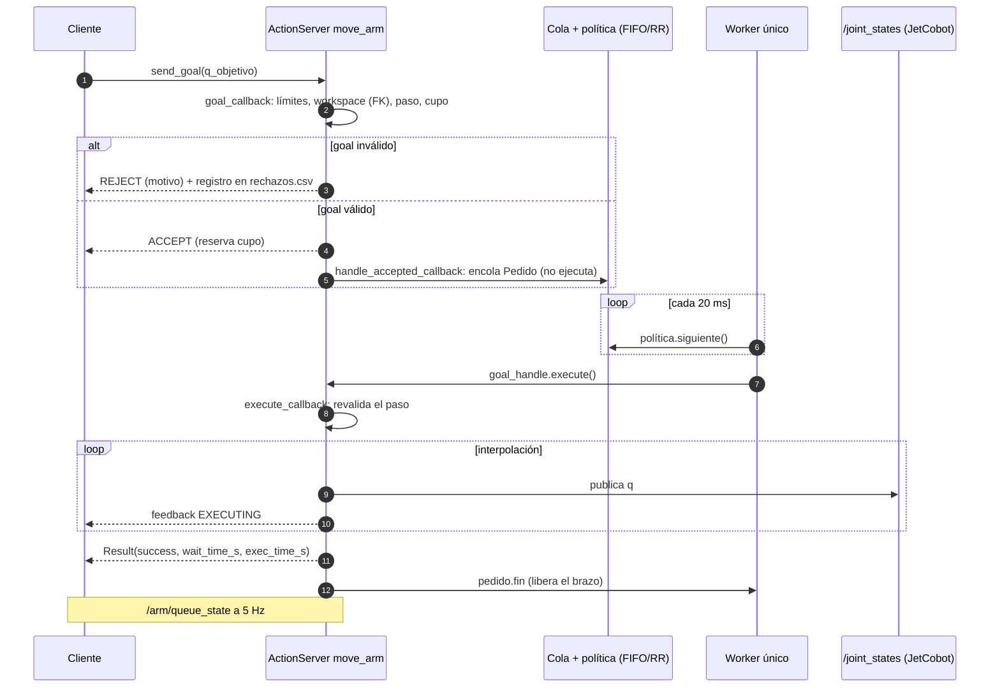

# Documento de diseño previo — Reto 2 · El Turno del Brazo

| Campo | Valor |
|---|---|
| Equipo 8 / `ROS_DOMAIN_ID` | `[ ]` / `[ ]` |
| Integrantes | `H.L.P.E`, `J.D.R.N`, `R.S.E.R` |
| Firma y fecha | `[ ]` |

## 1. Tabla DH y predicción previa (ítem 1)

### 1.1 Convención y tabla DH

Denavit-Hartenberg **estándar**: `A_i = Rot_z(θ_i)·Trans_z(d_i)·Trans_x(a_i)·Rot_x(α_i)`, con
`θ_i = q_i + offset_i` y `T_0_6 = A1·A2·A3·A4·A5·A6`; la posición del efector es la última columna de
`T_0_6`. Longitudes en mm, ángulos en rad dentro del código. Parámetros del **manual oficial** del
myCobot 280 / JetCobot (Elephant Robotics, Yahboom), implementados en `src/arm_broker/arm_broker/fk.py`:

| i | θ_i | d_i [mm] | a_i [mm] | α_i |
|:-:|:---|---:|---:|---:|
| 1 | q1 | 131.22 | 0 | +90° |
| 2 | q2 − 90° | 0 | −110.4 | 0° |
| 3 | q3 | 0 | −96 | 0° |
| 4 | q4 − 90° | 63.4 | 0 | +90° |
| 5 | q5 + 90° | 75.05 | 0 | −90° |
| 6 | q6 | 45.6 | 0 | 0° |

Se descartó la deducción previa en pizarra (d1 = 134.75, a2 = −110, d5 = 75.55, d6 = 50). Detalle (marcos,
límites articulares, workspace y puntos por confirmar) en [`tabla_dh.md`](tabla_dh.md).

### 1.2 Predicción previa de las 3 poses

Calculada con `fk.fk(q)` para el `q` comandado, **antes de volver a medir** con la tabla vigente
(`evidencias/item1/predicciones_dh_manual.txt`). Poses del ítem 1: `cero`, `ready` y `girada`.

| Pose | q comandado [rad] | x_pred [mm] | y_pred [mm] | z_pred [mm] |
|---|---|---:|---:|---:|
| `cero` | [0, 0, 0, 0, 0, 0] | 45.60 | −63.40 | 412.67 |
| `ready` | [0, −0.5, 0.5, 0, 0.5, 0] | 92.95 | −41.54 | 399.16 |
| `girada` | [0.6, −0.4, 0.4, 0, 0.3, 0] | 99.63 | 7.67 | 403.96 |

**Criterio de aceptación:** error de posición ≤ 10 mm en las tres poses. Procedimiento: se lee el `q`
realmente adoptado (`get_angles()`), se calcula `FK(q_real)` y se compara con `get_coords()`.

**Estado de la medición.** Con la tabla anterior (pizarra) ya se midió: 5.8, 5.9 y 5.9 mm
(`evidencias/item1/validacion_fk.txt`, predicción congelada en el commit `a0cbc35`). Esos valores no
sirven para la tabla vigente; **falta repetir la medición** con `herramientas/verificar_fk.py` y anotarla en
`tabla_dh.md` §6.1.

## 2. Diagrama de secuencia (ítem 2)

Camino de un goal: cliente → `goal_callback` (admisión con FK) → `handle_accepted_callback`
(encolado) → worker (política) → `execute_callback` → `/joint_states`.



## 3. Medición bajo contención: FIFO frente a Round Robin (ítem 3)

### 3.1 Qué se quiere saber

Si repartir el turno por clientes (Round Robin) cambia las esperas y el reparto respecto de atender
por orden de llegada (FIFO), con **exactamente las mismas condiciones**. La única variable es
`politica:=fifo` o `politica:=round_robin`.

### 3.2 Modelo y predicción (antes de medir)

Se usa un modelo de cola de un servidor con servicio constante `T` (≈ `duracion_movimiento_s`
+ un par de centésimas: 3.05 s con el valor por defecto) y las mismas clases `FIFO` y `RoundRobin`
del broker (`herramientas/simular_politicas.py`). Supuestos: cada cliente envía sus goals seguidos
(modo asíncrono, `pausa_s=0`), no hay rechazos y las poses son las válidas de la traza.

**Ideas que sostienen la predicción**

1. **La espera media global no depende de la política.** Con servicio constante los goals arrancan
   en los mismos instantes `T, 2T, 3T…` sea cual sea el orden; la política solo decide *a quién*
   le toca cada instante. Con `N` goals en total: media ≈ `(N−1)·T/2` y p95 global ≈ `0.95·(N−1)·T`.
2. **El orden de llegada de los clientes decide todo lo demás.** Con arranques escalonados
   (A, B, C, D, cada uno enviando su ráfaga completa) FIFO atiende cliente por cliente; Round Robin
   los intercala.
3. **Round Robin iguala las esperas medias por cliente, no reduce las extremas.** El último goal de
   cada cliente espera casi toda la corrida en Round Robin; en FIFO solo el último cliente.
4. **Equidad de Jain sobre goals atendidos.** Con una traza finita todos los clientes acaban
   atendidos por igual, así que al final de la corrida Jain vale 1.000 en ambas. La diferencia
   aparece **a mitad de la corrida** (`metricas.py` lo reporta como «Jain a mitad»).
5. **Si los clientes arrancan a la vez y sus goals se intercalan, FIFO y Round Robin coinciden.**
   Por eso el protocolo escalona el arranque.

**Fórmulas** (`n = poses × repeticiones` por cliente; cliente `k = 0…3` en orden de arranque;
`e = 0.5 s` de escalón entre clientes; `j = round(0.95·(n−1))`, el índice que usa `metricas.py` para el p95)

| | FIFO | Round Robin |
|---|---|---|
| Media del cliente `k` | `(k·n + (n−1)/2)·T − k·e` | `(2(n−1) + k)·T − k·e` |
| p95 del cliente `k` | `(k·n + j)·T − k·e` | `(4j + k)·T − k·e` |

Comprobación con `n = 10`, `T = 3.05`: FIFO, cliente 0 → media 13.7 s y p95 27.4 s; cliente 3 → p95
`(30 + 9)·3.05 − 1.5 = 117.4 s`. Round Robin, cliente 0 → media 54.9 s y p95 109.8 s.

**Valores para el caso de referencia**: 4 clientes × 10 poses × 1 repetición (`N = 40`), `T = 3.05 s`,
arranque escalonado A→D, prioridades A=1, B=2, C=3, D=4. Salen de
`python3 herramientas/simular_politicas.py --poses 10`. **Se vuelven a calcular con el número real
de poses de la traza oficial antes de congelar este documento.**

| Métrica | FIFO | Round Robin |
|---|---|---|
| Violaciones de exclusión mutua | 0 | 0 |
| Espera media global | 58.7 s | 58.7 s |
| **p95 global** | **111 s** | **112 s** |
| Espera máxima global | 117 s | 117 s |
| Media por prioridad 1 / 2 / 3 / 4 (A / B / C / D) | 13.7 / 43.7 / 73.7 / 103.7 s | 54.9 / 57.4 / 60.0 / 62.5 s |
| **p95 por prioridad** 1 / 2 / 3 / 4 | **27 / 57 / 87 / 117 s** | **110 / 112 / 115 / 117 s** |
| Índice de inanición (máx. espera de la prioridad 1) | 27 s | 110 s |
| Equidad de Jain al final | 1.000 | 1.000 |
| Equidad de Jain a mitad de corrida | 0.500 (A:10, B:10, C:0, D:0) | 1.000 (5 c/u) |
| Goals rechazados | 0 | 0 |

**Resumen de la predicción en una frase.** FIFO y Round Robin tendrán la misma espera media y
un p95 global casi igual (≈ 111–112 s con la traza de referencia); FIFO dará esperas muy
desiguales según el orden de llegada (prioridad 1: p95 ≈ 27 s, prioridad 4: ≈ 117 s) mientras
Round Robin las igualará (≈ 110–117 s para todas); en la mitad de la corrida Jain será ≈ 0.5 con
FIFO y ≈ 1.0 con Round Robin; y el índice de inanición será **peor** en Round Robin (≈ 110 s frente
a ≈ 27 s) porque en este orden de llegada el cliente de menor prioridad (A) es el primero en FIFO.

**Cómo se contrastará.** La medición tiene resolución de 0.2 s (`/arm/queue_state` a 5 Hz) y no ve
los goals que empiezan a ejecutarse antes de la siguiente publicación, así que se aceptan
diferencias de unos pocos segundos. Una desviación mayor se explica en el cierre reflexivo.

### 3.3 Protocolo experimental

| Elemento | Valor |
|---|---|
| Traza | Oficial del docente, mismo CSV en ambas corridas (`sha256` en `protocolo.txt`). Para ensayos: `trazas/prueba.csv` |
| Número de clientes | 4, en la misma máquina o en cuatro Raspberry, con nodos `cliente_A` … `cliente_D` |
| Prioridad por cliente | A=1, B=2, C=3, D=4 |
| Repeticiones | `[1]` (igual en ambas corridas) |
| Modo | `asincrono` |
| Pausa entre envíos | `0.0` s |
| Duración del movimiento | `3.0` s (`duracion_movimiento_s`) |
| Pasos de interpolación | `10` |
| Forma y orden de inicio | 1) broker con la política; 2) `ros2 bag record`; 3) clientes A, B, C, D con `inicio_unix` común más `0.5 s` de escalón entre uno y otro, para que las ráfagas lleguen en ese orden |
| Tópicos grabados | `/arm/queue_state`, `/joint_states` |
| Otros parámetros del broker | `cola_max=20` por defecto: si la traza tiene más de 20 poses por cliente, subirlo **igual en ambas corridas** para que no haya rechazos por cola llena |
| Una corrida por política | El orden de las corridas (FIFO y luego Round Robin, o al revés) se anota en `resultados.md` |

Variables que se controlan: traza, clientes, prioridades, repeticiones, pausa, modo, duración,
interpolación, orden de inicio, tópicos y `ROS_DOMAIN_ID`. Variable que cambia: la política.

Amenazas a la validez y cómo se atienden:

| Amenaza | Medida |
|---|---|
| Un cliente arranca tarde por lo que tarda `ros2 run` | Todos esperan a `inicio_unix` (margen de 8 s en `ARRANQUE_S`) |
| Rechazos por cola llena | Ajustar `cola_max` igual en ambas |
| Otro publicador en `/joint_states` | `ros2 topic info /joint_states -v` guardado en `publicadores_joint_states.txt` |
| Datos de una corrida anterior en el bag | El script no sobreescribe: exige una carpeta vacía |
| Otro equipo en el mismo dominio DDS | `ROS_DOMAIN_ID` propio (42 + n.º de equipo) |

### 3.4 Estructura de la evidencia

```
evidencias/
└── item_3/
    ├── fifo/
    │   ├── bag/                       (ros2 bag: /arm/queue_state y /joint_states)
    │   ├── queue_state.csv
    │   ├── joint_states.csv
    │   ├── rechazos.csv               (si hubo rechazos)
    │   ├── protocolo.txt              (parámetros reales de la corrida)
    │   ├── publicadores_joint_states.txt, bag_info.txt, broker.log, cliente_*.log
    ├── round_robin/                   (igual)
    ├── comparacion_politicas.png
    └── resultados.md                  (copia de resultados_plantilla.md, completada)
```

### 3.5 Comandos de ejecución

Ensayo previo con ROS 2 (traza provisional): [`ensayo_previo_ros2.md`](ensayo_previo_ros2.md).

Corrida oficial (una por política; el script deja todo en `evidencias/item_3/<política>/`):

```bash
source /opt/ros/humble/setup.bash && source install/setup.bash
export ROS_DOMAIN_ID=<42 + 8>

TRAZA=/ruta/traza_oficial.csv bash herramientas/experimento_item3.sh fifo
TRAZA=/ruta/traza_oficial.csv bash herramientas/experimento_item3.sh round_robin

python3 analisis/metricas.py evidencias/item_3/fifo/queue_state.csv \
    evidencias/item_3/round_robin/queue_state.csv \
    --salida evidencias/item_3/comparacion_politicas.png
```

Si los clientes corren en Raspberry distintas, se lanzan a mano con el mismo `inicio_unix` (un
mismo instante en segundos Unix, con relojes sincronizados por NTP) y los parámetros de la tabla 3.3.

### 3.6 Criterios de una corrida válida

- `total_rejected = 0` (o, si lo hubo, con causa en `rechazos.csv` y explicado).
- `total_accepted = total_completed` al final.
- `metricas.py` reporta 0 violaciones de exclusión mutua y `publicadores_joint_states.txt`
  muestra un único publicador.
- Misma traza (`sha256`) y mismos parámetros en `protocolo.txt` de las dos corridas.

### 3.7 Plantilla de resultados

[`evidencias/item_3/resultados_plantilla.md`](../evidencias/item_3/resultados_plantilla.md): métricas predichas y
medidas lado a lado, y contraste punto por punto con esta predicción.

## 4. Auditoría de la IK del firmware con la FK propia (ítem 4)

El equipo **no escribe un solver de cinemática inversa**: pide un objetivo cartesiano con
`send_coords()` y deja que el firmware resuelva la IK. Luego se lee el `q` que el brazo adoptó
(`get_angles()`, grados → radianes), se aplica la FK propia y se compara con el objetivo pedido:

`e = √((X_FK − X_obj)² + (Y_FK − Y_obj)² + (Z_FK − Z_obj)²)`, criterio **e ≤ 10 mm**.

- **Predicción antes de medir.** Si el firmware llega al objetivo, `e` queda cerca del desfase conocido
  de la FK frente a `get_coords()` (≈ 5.9 mm y casi constante con la tabla anterior; se actualiza al repetir el ítem 1); un valor
  mucho mayor indicaría un objetivo inalcanzable con esa orientación o un problema de marco.
- **Objetivo.** Primera corrida: reproducir un punto que el firmware ya alcanzó (la pose `ready`,
  `get_coords()` ≈ (100.9, −40.5, 395.4) mm, con la orientación leída en el robot). Los valores finales
  se miden en la sesión.
- **Herramienta y evidencia.** `herramientas/auditar_ik.py` (probada sin robot) y
  `evidencias/item_4/auditoria_ik.csv`, que por ahora solo tiene el encabezado: las filas se agregan
  con `--guardar` durante la sesión con el robot.
- **Estado.** Herramienta, pruebas y documento listos; falta la sesión. Detalle en
  [`item4_auditoria_ik.md`](item4_auditoria_ik.md).

## 5. Cierre reflexivo

Borrador en [`cierre_reflexivo.md`](cierre_reflexivo.md); los resultados se completan después de medir.
